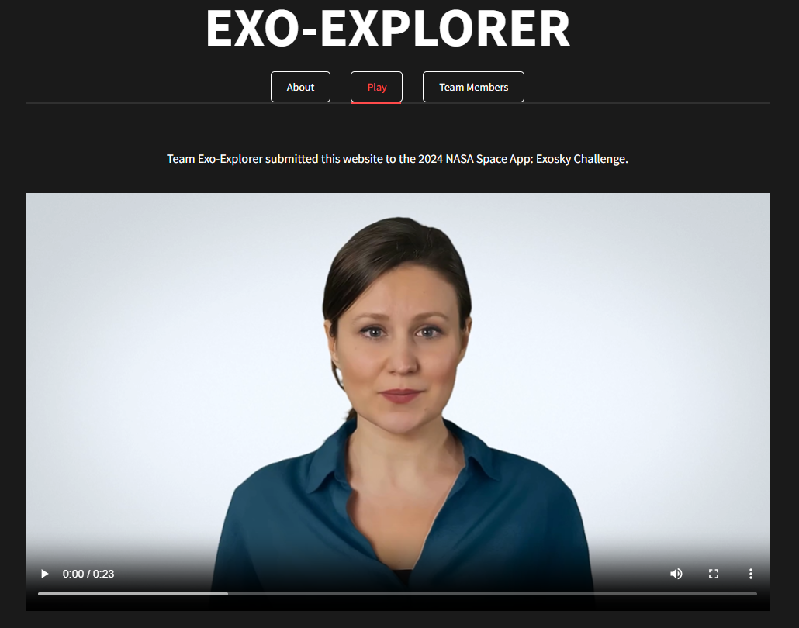
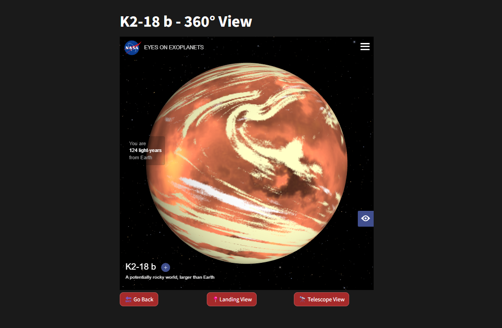
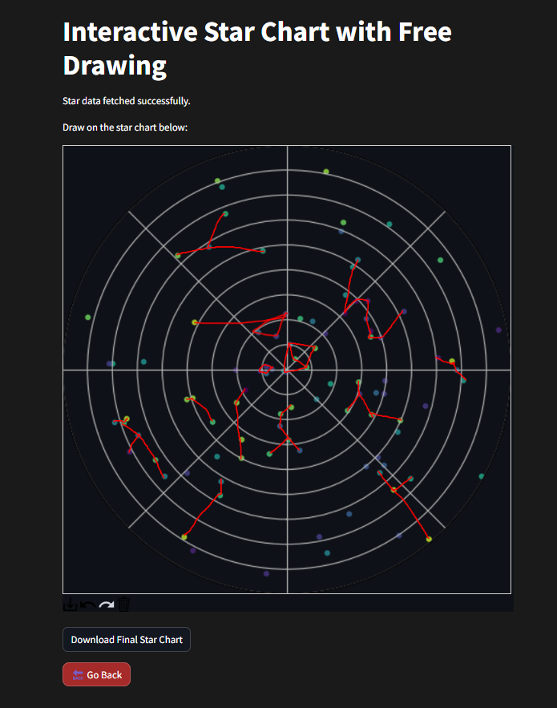

# EXO-Explorer
SpaceApps2024 : NASA Seattle Space App Challenge 2024

### Direct link to play : https://spaceapps24-exo-explorer-play.streamlit.app/

## Overview
This project consists of two separate applications that serve different purposes. Due to technical issues and time constraints, they have been organized into individual links.

## Links to Applications
- Homepage App - This app serves as the main interface for users. It contains a **About, Introduction, Team Members info** button that redirects to the Play App when clicked.
- Play App - This app allows users to interact and engage with the content.

### Homepage App : https://spaceapps24-exo-explorer-home.streamlit.app/
### Play App : https://spaceapps24-exo-explorer-play.streamlit.app/

Please click on the links above to access each application.

# APP preview 
 
 
 

# Connecting Github to VSC
1) **Download and Install Anaconda:** Visit the [Anaconda website](https://www.anaconda.com/download) and download the installer for your specific operating system.
2) **Install Anaconda:** During installation, keep everything set to the default settings.
3) **Install Jupyter and Visual Studio Code via Anaconda Navigator:**
    * Jupyter is useful for running small amounts of code.
    * Visual Studio Code is ideal for larger projects.
4) **Create a Folder:** Set up a folder to store the project code.
5) **Source Control in Visual Studio Code:**
    * Open Visual Studio Code and navigate to the **Source Control** tab.
    * Select **Clone Repository** and enter the GitHub URL for the repository.
6) **Select a Folder for GitHub Code:** Choose the folder where you want to store the cloned GitHub repository.
7) **Open the Folder in Visual Studio Code:** In Visual Studio Code, go to **File → Open Folder**, and select the folder where the GitHub code was saved.

# To Edit the Github Code in visual Studio Code 
1) **Open Anaconda and Launch VScode**
2) Open a termainal in viual studio code and install streamlit, astroquery, and streamlit-drawable-canvas 
    * to install astroquery type `pip install astroquery`
    * to install astroquery type `pip install streamlit`
    * to install astroquery type `pip install streamlit-drawable-canvas`
    * to install astroquery type `pip install pipreqs` 
3) **Run the Code:** Open the terminal in Visual Studio Code go to proper directory and type the following to execute the code.
4) `ls`
5) `cd website`
6) `streamlit run .\homepage.py` 

# To Edit the Github Code in Jupyter 
1)  Open **Anaconda** > Launch **Jupyter Notebook** > Navigate to your directory for the space apps project.
2) Open the Python file (with the `.py` extension) or both the `.py` and `.ipynb` files if needed.
3) Open the terminal in Jupyter Notebook while in the project directory.
4) Use the terminal to run `pip install` for any required packages not included with Anaconda.
5) Once all the packages are installed, run the code or app to ensure everything works correctly.

**Note**: The `.ipynb` format is highly recommended for step-by-step code execution and debugging. It provides better visibility into your workflow.

